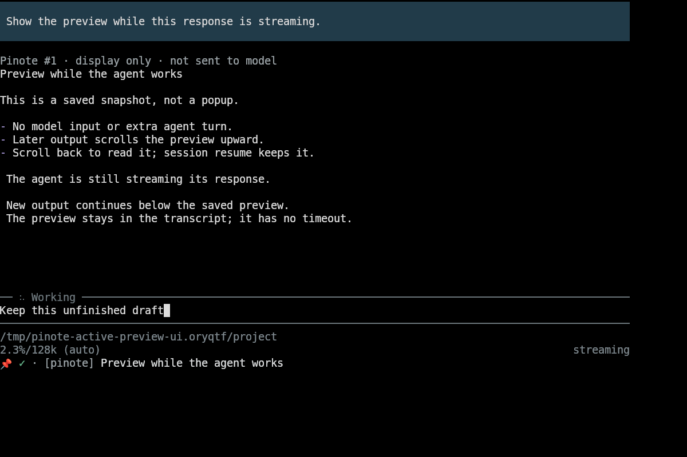
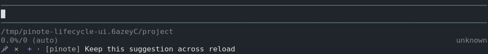
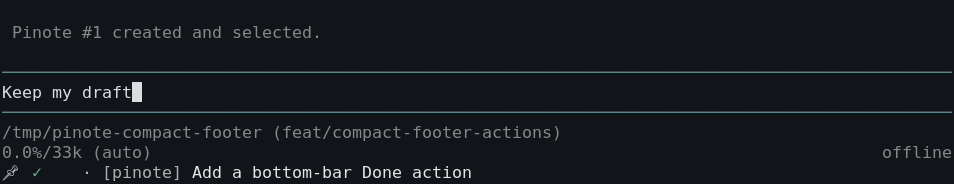

# pi-note

Persistent [pinote](https://github.com/kvidzibo/pinote) tasks and Markdown handoffs
in Pi: selected-task footer status, `/pi-note`, and agent current-task read/update,
add, and tag-listing tools.
The extension and Python app share a repository but install separately.

## Install

Requires Pi 0.99.1+, Node.js 22.19+ and **pinote 0.3.0+** (`note` on PATH). Add and tag listing need **pinote 0.4.0+**.
From this checkout, install the extension with `pi install ./pi`, then run
`/reload` in interactive Pi. The planned npm package name is `pi-note`; after its
first release use `pi install npm:pi-note` instead. It is not published yet. npm
installation does not run Python installers.

### CLI setup and upgrades

Install [uv](https://docs.astral.sh/uv/getting-started/installation/) first and
restart Pi with `uv` on PATH. At startup the extension checks `note --version`
against its bundled CLI version (currently 0.4.0), without network requests:

- Missing/unrecognized CLI: `/pi-note` opens Settings directly, where **Install CLI** is available.
- Older CLI: `/pi-note` opens Settings directly, where **Upgrade CLI** is available.
- Equal/newer CLI: neither installation action is shown; no upgrade notification.

Install and upgrade recheck the CLI version and ask before installing into uv's
isolated tool environment. Restart Pi or `/reload` after external CLI changes;
installation actions never reinstall an equal/newer CLI or intentionally downgrade it.
Python 3.11+ is required; uv can download a suitable interpreter when missing.
Installation downloads a pinned GitHub source archive and build dependencies,
not a similarly named PyPI package. It does not install GTK dependencies, edit
shell configuration, or change tasks. This checks the Python CLI bundled with
the installed extension, not the latest npm/GitHub release. Update the extension
first to receive a newer bundled CLI.

Back up your database before upgrading and update an optional GUI separately.
For checkout development, use `uv tool install --reinstall .` at the repo root
instead, so local Python changes are installed.

If setup reports a PATH problem, run `uv tool dir --bin` in your terminal,
put that directory before older `note` executables on PATH, and restart Pi.
Check `note --version`, then restart Pi or `/reload`. Network/build failures and
conflicting executables are reported without forcibly overwriting another
installer's commands. Fix the reported cause and retry; installs time out after
three minutes. Installation actions are unavailable while installation runs.
Setup hints direct users to `/pi-note` → Settings.
Missing uv is reported with its installation link, not installed
automatically. The [GTK desktop app](../README.md#optional-gtk-checklist) is optional
and still requires separate system dependencies.

The extension probes `note --version` before task commands: older CLIs interpret
unknown commands as note text and must be rejected before use. Remove the old
standalone `settings/pi/extensions/pinote.ts` entry if installed; load only one copy.

## Use

When the CLI is ready and no task is selected, `/pi-note` opens the task picker.
It marks the chosen task in progress and adds this default prompt to the editor:
“Read the current Pinote task. Summarize your understanding, but don’t start work yet.”
If the CLI is missing or older than the bundled version, `/pi-note` opens Settings
directly so the relevant CLI installation action remains accessible. **Tab** opens
Settings from the picker or task view; **Tab** from Settings returns to tasks.
The agent fetches current task text and saved handoff fields when you submit;
they are not copied into the draft. The default prompt asks for a summary, not implementation.
Existing drafts are preserved; nothing is submitted automatically.
With a selected task, `/pi-note` offers **Continue**, **Done**, **Switch task**, and
**Settings**. Settings provides **Preview task**, **Complete task (new session)**,
**Accept suggestion**, and **Dismiss suggestion** when applicable, plus
**Install CLI** or **Upgrade CLI** only when needed. Settings also lists fields found
on the current task, so existing values can be configured without creating another task.
Type in the task picker to filter by text, ID, tag, or state (all words must match).
Use ↑/↓ and Enter to select, or Esc to cancel. Rows show **●** for in progress or
**○** for active, followed by the tag (`[Untagged]` when absent).
The normal Pi status area shows selected-task controls and title without replacing other footers. The footer omits the task ID and state and shows only the first line, bounded by `footer.titleWidth` (default 60 terminal columns including the pin, controls, tag and title). Overflow ends with `...`. The title remains clickable for preview; task controls are separate. At very small widths controls are hidden (pin only). The pin and controls are bundled in `icons/note.txt`, `icons/check.txt`, `icons/cross.txt`, and `icons/add.txt`; they use terminal fonts, not a Nerd Font or icon theme. Icons are bold; their apparent weight depends on the terminal font, and emoji may look unchanged.

### Display-only preview

Use **Preview task** in Settings to print the selected task's full Markdown text
and saved agent fields in the transcript. The preview is labeled **display only · not sent
to model**: it is a local custom session entry, excluded from subsequent model
requests, compaction and branch summaries. It survives session resume but does not
modify the note, editor draft or task selection, and never starts a model call.
The agent can still read the task separately with `pinote_get_current`.
Click previews work while the agent is running, provided no other Pinote operation
is open. Each click saves a fresh snapshot in the transcript, above any currently
streaming response. Later output scrolls it upward; it does not expire. Preview
reads never lock out the agent's task updates. Settings still requires Pi to be idle.



On Linux, the task text (pin, tag and title) is a clickable OSC 8 link to a
private per-session Unix socket. Overflow at the configured title width stays linked.
The package ships [a Kitty configuration example](kitty/open-actions.conf).
Append its block to `~/.config/kitty/open-actions.conf`, preserving existing
actions. Replace `/absolute/path/to/pi-note` with the installed package directory
containing `preview-click.cjs`; for this checkout, that directory is `pi/`.
Keep `${URL}` literal: Kitty substitutes the clicked task's link.

```conf
protocol pi-note-preview
action launch --type=background node /absolute/path/to/pi-note/preview-click.cjs ${URL}
```

Do not replace or symlink your entire Kitty configuration to the example: it
contains only Pinote's handler. Package installation does not edit Kitty files.

Reload Kitty with **Ctrl+Shift+F5**. In Pi's regular mode, click the task text; in
fullscreen mode, use **Ctrl+Shift+click** so Kitty handles the link instead of
Pi's system URL opener. The helper sends only an authenticated selection
identifier, never note content or a model prompt. Stale links after task switching, tree navigation, reload or session exit
are rejected. The **Preview task** Settings action is also available when the
socket cannot start; the task remains visible without a link.

Each Pi session remembers its own task, including several sessions in one folder.
Resume restores that session's task; a new session starts unselected and does not import
an older per-folder selection. Pi saves the session after the first submitted message;
quitting before that leaves the next launch unselected, while the task stays in progress.
Use **Continue**
to insert the same configured prompt. Completing, removing, or scheduling a task clears it
from sessions that refresh it. Switching does not complete or reset the previous task.
Task fields such as `Worktree` and `PR` stay on the task, so sessions can use separate
worktrees and pull requests. Task status refreshes at session start, before/after
agent activity, and after commands/tools. The CLI's per-directory `agent selected`
command is not this session memory.

### Personal configuration

Configure `~/.pi/agent/pi-note.json` (or the agent directory set by
`PI_CODING_AGENT_DIR`):

```json
{
  "handoffPrompt": "Read the current Pinote task. Summarize your understanding and proposed approach, but don’t start work yet.",
  "taskOfferPolicy": "github-remote"
}
```

`taskOfferPolicy` controls the agent's task-offer guidance:

- `always` (default): offer a task when given work with no task selected.
- `github-remote`: first verify with Git that the repository has an HTTPS or SSH
  remote hosted on `github.com`; otherwise do not offer. Local paths and other
  hosts do not qualify. This is agent guidance, not a network or PR-access check.
- `never`: do not offer tasks; explicit requests to create one remain allowed.

All policies preserve the existing creation tools, user-consent requirement,
and selected tasks. Run `/reload` after changing this setting. Invalid policy
values or unreadable/malformed configuration suppress offers; interactive startup
warns until you fix the file and reload. No project-local configuration is read.

In `/pi-note → Settings`, select **Task prompt** to edit the text inserted after
selection or **Continue**. **Shift+Enter** or **Ctrl+J** adds a newline; **Enter** saves it
globally, **Ctrl+C** clears the edit, and **Esc** cancels that unfinished edit.
Settings and fields save automatically after each confirmed change; no separate
Save action is needed. Leaving Settings with **Esc** or **Tab** keeps saved changes
and discards only unfinished input. Saving never changes existing editor input or submits anything.

Task selection and **Continue** reread `handoffPrompt` each time; changing that
field needs no `/reload`. Its value is literal text, not a prompt template; use
`\n` in JSON strings for multiple lines. It must be a nonblank string without control
characters other than tabs and newlines. A missing file or key uses the default.
Invalid/unreadable configuration reports an error without starting/switching a
task or changing the editor. Menu **Done**, footer completion, and agent tools are
unaffected. If configuration is invalid or unreadable, Settings shows only task,
suggestion, and CLI actions; repair `pi-note.json` before editing preferences.
Invalid configuration is never replaced with defaults. This is user-level
configuration only; project-local files are not read.

### Agent tools

- `pinote_get_current`: read this session's selected task, including its revision.
  Takes no arguments; returns null when this session has no selected task.
- `pinote_update_current`: supply `expected_updated_at` from that read and arbitrary
  `set` label/value pairs or `remove` labels. Updates the selected task only, with no
  ID argument. Updates merge fields, never replace the task text or tag. Fails if
  no task is selected or the selection changes during the operation. If another
  process changed the task, read again before retrying.
- `pinote_fields`: read the user's global footer definitions (names, display labels,
  links, formats, widths), even without a task. Agents should read this before
  populating relevant values with `pinote_update_current`. Empty/missing values
  stay hidden; this tool does not edit configuration.
- `pinote_tags`: list saved tag names.
- `pinote_propose`: show a suggested task beside the pin icon in the footer without
  creating a note. Optional `tag`; full text is retained, but the footer shows only
  its title. Requires a TUI with no selected task. The agent continues your work
  while the suggestion awaits your choice.
- `pinote_add`: create an active task. Optional `tag`. `select: true` starts and
  remembers it for this session only; use that only after the user agrees.

Version 0.7.0 replaces `pinote_get`/`pinote_update` with these current-task tools
and removes `pinote_tag`, without aliases. Agents cannot read/update tasks by ID
or retag existing tasks; use `/pi-note` to select an existing task.

When allowed by `taskOfferPolicy`, the agent uses `pinote_propose` instead of
asking in chat. The pin footer shows a pending suggestion, distinct from a selected task:

```text
📌 ✕  + · [tag] Task title...
📌 ✓ · [tag] Task title...
```




- Muted **✕** dismisses without creating a note; further offers are suppressed until a new session.
- Accent **+** creates, starts, and selects the suggested task.
- Green **✓** completes the selected task, starts a clean unselected session, and reloads Pi without a completion prompt. Menu **Done** and **Complete task** in Settings do the same.

Done occupies the former ✕ position, not the + position, so clicking Add twice cannot accidentally complete the new task. The selected row removes the former + cell's padding. The selected task's title is a separate preview link.

The configured `footer.titleWidth` bounds the entire row (default 60 columns). Controls stay first; the tag is dropped before truncating the first-line title with `...`. Tiny widths hide controls (pin only). Pi can still clip the combined status row on narrow terminals.

Controls use the [Kitty preview handler](#display-only-preview), with no additional configuration. Fullscreen Kitty uses **Ctrl+Shift+click**. The Settings actions **Accept suggestion** and **Dismiss suggestion** perform the corresponding footer actions. No action submits input or starts an agent turn. Add and Dismiss preserve editor drafts; **Complete task** starts a clean session and reloads Pi, discarding the editor draft, so save unfinished input before completing a task.

Completion requires an idle Pi session and no pending Pinote operation. It rejects stale selected-task links and externally changed revisions. Accepted mutations drain even if the helper disconnects. On an error, check `/pi-note` before retrying, because a write may already have committed. Failed or stale writes never restart Pi. If another extension cancels the new session, the task remains completed and Pi reports the cancellation. The reload runs through the new session's fresh context; retired contexts are not reused.

An existing suggestion is retained rather than replaced. Pending suggestions survive `/reload` and session resume, including their full text and tag; new links replace stale capabilities. Accepted or dismissed suggestions never reappear on reload. New sessions and forks start without a suggestion; selecting a task or navigating the tree clears it. Suggestion state is local, display-only session metadata, not model context. Pi saves the session after the first submitted message; quitting before that can still lose unsaved session state. Repeated acceptance cannot duplicate a note. A busy Pinote operation blocks acceptance. Noninteractive agents still ask in chat before using `pinote_add` with `select: true`. An existing selection is not replaced unless the user asks to switch. Reuse a saved
tag name when it fits.
Task text starts with a short, action-oriented title (aim for at most 60 characters).
Put context, URLs, commands, and acceptance criteria after a blank line; the title
should not contain implementation details. This is agent guidance, not a storage limit.

Agents are guided to keep notes to three short bullets total: relevant outcome,
blocker, and next action. Replace stale notes; omit narration, repeated task text,
and routine test logs. Keep a GitHub pull request in `PR`. Set configured footer
fields with Markdown values; remove a field to hide it. Without a configured field
list, append its label to `Bar`, one label per line. Do not list `PR` in `Bar`.
Agents use `pinote_update_current`; there is no separate `add_to_bottom_bar` tool.
This is guidance, not truncation or a storage limit.

Values are Markdown strings; no fields are required. `PR` can display a clickable link without GitHub polling.
`Bar` chooses extra footer fields unless configuration overrides it:

```markdown
## Agent
PR: [Task selection #42](https://github.com/org/repo/pull/42)
Dashboard: [Metrics](http://127.0.0.1:3000/d/app)
Next: Address review comments
Bar: Dashboard
Next
Jira: [PROJ-123](https://example.atlassian.net/browse/PROJ-123)
CWD: `/home/me/project`
```

The GTK preview renders this section using its existing safe Markdown renderer.
Fields are stored separately from task text, retained in history, and survive
sessions. Labels are case-sensitive (trimmed, Unicode-normalized), at most 64
characters; values are at most 4096 characters. Maximum 64 fields / 32 KiB JSON
per task. Use removal rather than empty values.

### Footer configuration

Add `footer` to `~/.pi/agent/pi-note.json` (or `pi-note.json` under
`PI_CODING_AGENT_DIR`), preserving any existing `handoffPrompt`:

```json
{
  "footer": {
    "titleWidth": 40,
    "fieldWidth": 30,
    "maxFields": 4,
    "fields": [
      { "name": "PR", "label": "", "link": true, "format": "#<number>" },
      { "name": "Dashboard", "label": "Dashboard", "link": true, "format": "<value>" },
      { "name": "Next", "label": "", "link": false, "format": "<value>", "width": 24 }
    ]
  }
}
```

Widths are terminal columns, including the pin, tags or field labels, and must be
integers from 3 to 1000. Defaults: `titleWidth: 60`, `fieldWidth: 60`,
`maxFields: 4` (allowed 0–64). Each field can override `fieldWidth` with `width`.
`fields` selects task field names in order, regardless of a task's `Bar`.
Names are case-sensitive, trimmed and NFC-normalized, at most 64 characters;
`Bar` is reserved and duplicate names are rejected. Up to 64 definitions are
accepted. Missing/blank values do not display and do not consume the field limit.
`[]` or `maxFields: 0` hides configured fields, including PR.

In `/pi-note → Settings`, **Add field** adds a global display definition, not a
task value. Select any field to edit **Link**, **Label**, **Format**, and **Width**.
Label starts as the field name; clear it for no prefix. Link off displays plain
text without a clickable link. Toggles, field additions/removals, and edits confirmed
with **Enter** save immediately. **Esc** returns from a field to settings without
undoing saved changes. Invalid edits and failed saves stay open with an error;
failed saves leave saved values unchanged and can be retried. Saves include the task
prompt, preserve unrelated settings (such as `taskOfferPolicy`), and reject external
configuration changes made since opening settings or the last successful save.
Concurrent saves use `pi-note.json.lock`; remove stale locks only when no save is
running. Symlinked configuration must be edited manually; saves never replace the link.

Formats support `<value>` (Markdown display text), `<url>` (one safe link target),
and `<number>` (a GitHub PR number or numeric field value). With a blank label,
PR format `#<number>` displays `#123`; Link on makes it clickable. An unavailable
placeholder hides the field. The template is literal text, not executable code
or Markdown. Default format is `<value>`, or `#<number>` for PR.
String definitions and the older `{ "label": "Next", "width": 24 }` form still
work. Absent/`null` fields retain the legacy automatic PR link plus `Bar` fields;
the first Settings save turns this legacy list into explicit global definitions.

Settings saves apply immediately in this Pi session. Run `/reload` after manual
footer edits or in other running sessions; settings are also reread on session start.
Invalid footer configuration warns and uses footer defaults; missing files silently
use defaults. The task prompt is also read separately on selection/Continue as
described above; prompt changes need no reload in any running session.
This is user-level configuration, not task data; agents should not change it
without approval. Task values still come from `pinote_update_current`.

### Footer links

The selected active or in-progress task can show fields after its title.
Legacy configuration automatically shows a valid `PR` as **PR #123**.
With an explicit field list, PR presentation is configured like any other field.
Configured `fields`, or otherwise `Bar`, selects field names. Each listed value is
Markdown: the footer shows its text, and links in it are clickable for any scheme
except `javascript:`, `data:`, and `vbscript:`. Credentials, control characters,
and targets over 2048 characters after serialization are shown as text but not
linked. `Bar` itself is never displayed.
By default, at most four extra fields are shown, each truncated to 60 columns.
Overflow ends with `...`, including cuts between Markdown/link segments. Removing
a listed field hides it even if configuration or `Bar` still names it. Terminal
OSC 8 support is required for clicking links. Pi joins footer statuses on one
line and truncates the combined line with `...` when the terminal is narrow.
Pi's final ellipsis is plain text; click the remaining task text to preview it.
This extension does not replace other footers. Other fields, such as `Jira` and
`CWD` in the example, stay off the footer unless selected.

### PR links without polling

Set `PR` with `pinote_update_current` to one `https://github.com/owner/repo/pull/123`
URL or Markdown link. Legacy footer settings show clickable **PR #123**; global
field settings can change or hide it. PR and other field links are rendered locally
for the active selection and disappear when that selection is cleared.

Pinote no longer polls GitHub, runs `gh`, watches completed tasks, or prompts on
PR merges. No GitHub authentication is required. `PINOTE_PR_POLL_SECONDS` is no
longer used. Other separately installed Pi PR/Git extensions are unaffected.

Tools work without a TUI, but `/pi-note` needs an idle TUI.
This package does not synchronize databases or paths between machines. Note text
and fields loaded into Pi are sent to the configured model when used as context;
avoid secrets. Agent commands do not send desktop notifications.

## Development and releases

From the repository root:

```sh
uv sync --locked
npm --prefix pi ci --ignore-scripts
npm --prefix pi test
(cd pi && npm pack --dry-run)
```

The load test uses the real Pi loader and checkout's `.venv/bin/note` with temporary
data. Run visual checks under Xvfb/private D-Bus; never use personal task data.

`.github/workflows/publish.yml` follows the other Pi packages: every push to
`main` runs the full Python/GTK/Pi tests, then publishes a new npm version using
OIDC trusted publishing and provenance. Existing versions are skipped; registry
failures fail the workflow. No npm token is stored in GitHub.

One-time maintainer setup (not performed by installing this package):

1. From `pi/`, run `npm login`, then `npm publish --ignore-scripts --access public`
   to bootstrap `pi-note` after checking name availability.
2. In npm's package settings configure the GitHub trusted publisher: owner
   `kvidzibo`, repository `pinote`, workflow `publish.yml`, no environment.
3. Add verified npm and Pi package-directory links here after publication.

The CLI source pin in `setup.ts` must point to a verified immutable commit with a
compatible Python package. Update it and the bundled-version setup text together
when releasing Python changes; verify installation in a temporary uv tool directory.

Subsequent releases: run `npm version patch|minor|major --no-git-tag-version`
inside `pi/`, commit both version files in a PR, and merge through the normal
review/check process. Python and npm versions are independent; update the stated
minimum CLI version whenever the integration contract changes.
